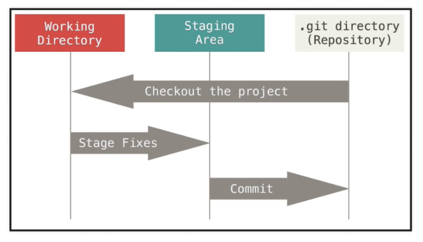

# UVA workshop!

```diff
-Last updated 11-Feb-2021
```

> <em>Fork edits</em>

# git-intro


> <em>Changes made here. More changes.</em>

UVA Library Workshop on Introduction to Version Control and Git/Github


## About Me
* Erich Purpur: I am a Research Librarian for Science & Engineering in the Brown Science & Engineering Library. I've been at UVA for about 3.5 years

## Data Resources in the UVA Library
* [Research Data Services](https://data.library.virginia.edu/)
* [Workshop Series](https://data.library.virginia.edu/training/)

## First, our goals

1. Learn the background of version control
2. Everyone has a GitHub account
3. Create and fork a repository
4. Feel comfortable with git/github workflows
5. Know how to get help

## Second, some terms

* git - version control software installed on your local machine
* GitHub - a for profit company owned by Microsoft. It provides cloud-based hosting of repositories.
* GitLab - an alternative to GitHub, not owned by Microsoft ([why you might want to switch](https://about.gitlab.com/2017/07/19/git-wars-switching-to-gitlab/)). "Free software deserves free tools."
* repository (repo) - Basic unit in git: a record of all changes to specified files.
* fork - personal copy of another users repo.
* branch - a parallel version of a repo (main branch is called "main", formerly "master").

[Git Glossary](https://help.github.com/en/articles/github-glossary)

You can look at GitHub's [Git Handbook](https://guides.github.com/introduction/git-handbook/)

## Outline

0. Some background
1. Work on the GitHub browser interface
2. Look at the GitHub Desktop interface
3. Tips on getting help


## A brief history of Version Control

* SVN (2000s) Centralized (client-server)
* git (2005) Distributed. Developed by [Linus Torvalds](https://en.wikipedia.org/wiki/Linus_Torvalds) for Linux development.


## Things to have before we begin

* Github account: https://github.com/
   -Create a free account if you don't have one yet
* A text editor or IDE. If you don't already have one, you can use something very simple like Notepad++: https://notepad-plus-plus.org/
   -R studio
   -Anaconda/Spyder
   -Visual Studio Code
   -Any plain text editor
* Git
  -For Windows: https://www.youtube.com/watch?v=albr1o7Z1nw (watch first 2:45)
  -For Mac: Git is usually installed by default but just in case: https://www.youtube.com/watch?v=sJ4zr0a4GAs


# Let's Get Started!

We will be using the git command line tool for this workshop. There are also GUI (graphical user interface) tools available, but version control is generally done at the command line. There is a limit to what the GUI tools can do and eventually you'll run into those barriers. Once you get used to it, the command line is the way to go.

If you are using Windows, open the git client. If you are on a Mac, open the terminal.

Let's see which version of git you have and also to check if it is installed.
```
git --version
```

### Set Config Values

This allows you to 
```
git config --global user.name "Your Name"
git config --global user.email "Your Email"

git config --list
```
Type "q" to exit.

## Two Common scenarios while using Git

### Scenario 1. Initialize a repository from existing code
This is the case that you have a local code base that you want to start tracking using git. So let's quickly create a few files. First, navigate to where you want them to be created.

```
mkdir testgit

cd testgit

touch testfile.txt

ls
```
Now, open up testfile.txt in any text editor and copy the following code into testfile.txt. This is python code, but you don't need to know python in order to follow this example.

```
def add_function(a, b):
    return a + b
    
def subtract_function(a, b):
   return a - b
```
#### Track this code with git

```
git init

ls - la
```
Because the .git directory is hidden, you need to use ```ls - la``` to see hidden files. The .git directory contains everything related to our repository. If you want to stop tracking this repo, you can just remove the .git directory as you would any other using ```rm -rf .git```


#### Our first Commit

Before we make a commit, let's check the status of the directory. You'll see which files are untracked in our directory.

```
git status
```



#### Add files to staging area

Add all the files
```
git add -A
```
or add them individually

```
git add testcode.py
git add `your file name here`
```

if you made a mistake, you can remove them from the staging area

```
git reset 'your file name here'
```

#### Commit the changes

When you make a commit, you want to write a descriptive message log. Not something generic like "made a bunch of changes". Be descriptive! If you need to look back in the commit logs for when you made an error, you will thank your former self that you left some clues about where to look. 
```
git commit -m "Message about changes here"
```

Let's look at the status again to make sure it worked.
```
git status
```

Or we can look at the commit we just made

```
git log
```

### Scenario 2: Track an Existing Remote project with Git
This is probably more likely how you will be using git in reality. Someone, or a group, has probably has written some code that you want to download and use for yourself, make changes to, and develop over time. 

#### First, fork my repository
In the top right corner of the screen, click 'fork'. You'll make a copy of my <b><i> git intro </i></b> repository for yourself. We are doing this so that we are not all pushing changes to my remote repository at once, but instead to your own repository as if it was the 'master'. 


#### Clone a remote repository
This creates a clone of a remote repository, a .git directory is created to track changes.
```
git clone <url> <where to clone>
```
If you want to clone this github repo to your current working directory, use the following. Remember, this should be a URL to your own fork of the remote repository. Not mine!:
```
git clone https://github.com/epurpur/git-intro . 
```

Check to see if this worked and view what is inside your current directory
```
ls -la
```

#### View information about the remote repository

List the information about the repository
```
git remote -v
```

List all of the branches in our repository (both locally and remote). We have not covered branches yet but we will very shortly!
```
git branch -a
```

#### Pushing Changes
Now that we have a cloned repository, we want to develop our code and make changes to it. 

#### Commit Changes

First, let's see the changes we have made to the code
```
get diff
```

and check the status
```
get status
```

and make a commit LOCALLY. We have not yet changed anything in the remote repository.
```
git commit -m 'Edited multiply function'
```

#### Push changes to the remote repository

Remember, we are now working on a project that could potentially have multiple developers. People could have been working on different parts of the code at the same time we were doing our own work, so first you want to pull any changes from the master branch of the remote repository that have been made since the last time we pulled from that repository.

Origin is the name of the remote repository. Master is the name of the branch we are pushing to.
```
git pull origin master
```
Now let's push our changes to the remote repository.
```
git push origin master
```

## Branching

So far we have been working only on the master branch of our repository. But this really isn't how you should use version control and git in your day to day workflow. This is where branching comes in. 

A common workflow is to create a branch for your desired feature, then begin working off of that branch. 

#### Creating a branch

```
git branch calc-divide
```
Now let's see our local branches to make sure it worked correctly. You see the * next to master, indicating we are still working in the master branch, though we have created a new one called 'calc-divide'.
```
git branch
```
And now we move into our new branch. We must check out the branch in order to work in it.
```
git checkout calc-divide
```
and let's make sure we are now working in the 'calc-divide' branch. See the * has now moved to our new branch. 
```
git branch
```
If that is all correct, now we can work on our features. So let's make some changes to our code. Once we have done that let's push our changes to our local branch.
```
git status

git add -A

git commit -m "changed divide function"
```

#### Push branch to remote repository
```
git push -u origin calc-divide
```
The '-u' tells git we want to associate our local 'calc-divide' branch without remote 'calc-divide' branch. 
```
git branch -a
```
Now see all our branches, both local and remote, to see that we have now created and pushed our 'calc-divide' branch to our remote repository. 

We will now merge our 'calc-divide' branch with our master branch. 

#### Checkout our local master branch
First we want to do this merge locally before pushing it to the remote repository.
```
git checkout master
```
Pull any changes that have been made to the master branch while we have been working on our features.
```
git pull origin-master
```
Merge the branch
```
git merge calc-divide
```
Check to see that we have merged the branch
```
git branch --merged
```
Now, push the local master branch to the remote master branch
```
git push origin master
```

#### Delete the Branch
Now that we have merged our branch, that feature is done and we can delete the branch. 

First, let's delete it locally
```
git branch -d calc-divide
```
Don't forget, this branch now also exists in the remote repository. 
```
git branch -a
```
You should see that we still have the 'calc-divide' branch in the remote repository. Now we will delete it from the remote repository.
```
git push origin --delete calc-divide
```

This seems like a lot of work but it becomes very fast once you begin to do it every day!


### Using Github
### Step 0 - Inspect this Current Repo
* In a web browser, visit this repo: [https://github.com/rjp0i/git-intro](https://github.com/rjp0i/git-intro)
* We are in the github interface:
  1. upper left corner: notebook icon next to rjp0i/git-intro  (a repo)
  2. big green button on the right hand side (down a little) says "Clone or Download" (how to get the files)
  3. list of files (how to browse the files)
  4. readme.md is rendered as Markdown (github automatically shows the readme file, very handy)
  
### Step 1 - Create your own Repo 
[https://guides.github.com/activities/hello-world/#repository](https://guides.github.com/activities/hello-world/#repository)
* Not so obvious, but in the upper right hand corner, click the '+' button, pull down: select 'new repository'
  1. name (this will be the address of the repo...)
  2. description
  3. public v private
  4. initialize with readme (alway say yes)
  5. license
  
### Step 2 - Create a Branch (for Direct Collaborators)
[https://guides.github.com/activities/hello-world/#branch](https://guides.github.com/activities/hello-world/#branch)
* Let's leave the master branch alone and create a new branch
 1. Click the drop down at the top of the file list that says branch: master.
 2. Type a branch name, readme-edits, into the new branch text box.
 3. Select the blue Create branch box or just hit “Enter” on your keyboard.

Now we have two branches: master and readme-edits

### Step 3 - Edit a File and Commit Changes
[https://guides.github.com/activities/hello-world/#commit](https://guides.github.com/activities/hello-world/#commit)
* You should now be in the readme-edits branch.
* Click on README.md in the list and then click the pencil to edit the file
  1. now type in the editor
  2. when done click green button at bottom 'commit changes'
    * commits can/should(?) be done early and often
    * no change is too small to commit, but you'll get a feel for how often you should commit after some time
    * but always write a commit message that describes your changes
    
* Now the master and readme-edits branches differ
    
### Step 4 - Making Pull Requests
[https://guides.github.com/activities/hello-world/#pr](https://guides.github.com/activities/hello-world/#pr)
* Indirect Collaboration - pull requests
  1. Click the "Pull Request" tab, then "New pull request" 
  2. In the Example Comparisons box, select the branch you made, readme-edits, to compare with master (the original).
  3. Proofread your changes in the diffs on the Compare page 
  4. When ready to submit, click the Create Pull Request Button 
  5. Write a title and a brief description of your changes 
  6. Click Create Pull Request
  
  ### Step 5 - Merging Pull Requests
  [https://guides.github.com/activities/hello-world/#merge](https://guides.github.com/activities/hello-world/#merge)
  * Now, let's merge the Pull Request, to bring the changes from readme-edits into the master branch.
  1. Click the green Merge pull request button to merge the changes into master.
    
  2. Click Confirm merge.
  3. Now we can delete the readme-edits branch, since its changes have been incorporated into master. You'll be prompted to do so inside the purple box. 
  
  
  ### Step 5.1 - Resolving Conflicts when Merging Pull Requests
  [https://help.github.com/en/articles/resolving-a-merge-conflict-on-github](https://help.github.com/en/articles/resolving-a-merge-conflict-on-github)
  * Any time a merge is attempted when changes have been made to both versions of the same line of a file (in the master and in a fork, say), then you will have to resolve the conflicts in the merge.
  * Often, you can just use the github interface to do this. If this is the case (i.e., the conflict isn't too complex), a Resolve Conflicts button will appear (and not be greyed-out). 
  
  * Clicking on "Resolve Conflicts" will show you the conflict and use symbols to indicate the location of the conflict (`<<<<<<<branch1-name`, `=======`, `>>>>>>>branch2-name`), and the two versions of the conflicting line. 
  
  * Choose the correct version of the line (or edit one version), then remove the other version and remove the symbols and the branch/fork names, <em>leaving only the text you want in the final version</em>.
  * Resolve any other marked conflicts in the file.
  * Click on Mark as Resolved.
  
  * Resolve conflicts in any other files.
  * Click on Commit Merge (and click on the I understand pop-up).
  
  * Finally, click on Merge Pull Request, and then confirm the merge.


### GitHub Flow
[https://guides.github.com/introduction/flow/](https://guides.github.com/introduction/flow/)


### Forks - Indirect Collaboration
  If you are not a collaborator in a repo, you can't branch that repo. However, you can "fork" it, which is just creates a clone of the repo on the GitHub server.
  1. You can't push changes directly back to the original repo.
  2. You'll want to work on keeping your fork in sync with the project
      * add it to the original project as a remote, or
      * fetching regularly from the original repo
    
  Try forking from my repo, and make changes to the resulting fork, and then submit a pull request to me!
  
 
### Additional Items
  * Command Line Interface (CLI) [cheat sheet](https://education.github.com/git-cheat-sheet-education.pdf)
  * [Create your own Webpage](https://pages.github.com/) (such as https://rjp0i.github.io/intro.html)


## Getting Help

* Please, feel free to email me: ricky@virginia.edu
* The book <em>Computing Skills for Biologists: A Toolbox</em> contains a very useful introduction to Git, with practice data and code. Members of the UVA community can access the book [online](http://proxy01.its.virginia.edu/login?url=http://www.degruyter.com/isbn/9780691183961)
  * The examples, data, code and solutions are hosted on a [github repo](https://github.com/CSB-book/CSB](https://github.com)/CSB-book/CSB)
* Lots of [git](https://git-scm.com/)/[GitHub](https://guides.github.com/)/[GitLab](https://gitlab.com/help?nav_source=navbar) resources from the source, as well as free training through a number of github sites
* StackOverflow is another good resource (e.g., for questions concerning git (or GitHub/GitLab): [https://stackoverflow.com/questions/tagged/git](https://stackoverflow.com/questions/tagged/git)

## Reference for Git

The book <em>Computing Skills for Biologists: A Toolbox</em> contains a useful introduction to Git with practice data and code. Members of the UVA community can access the book [online](http://proxy01.its.virginia.edu/login?url=http://www.degruyter.com/isbn/9780691183961). 
The examples, data, code, and solutions are hosted on a [github repo](https://github.com/CSB-book/CSB]https://github.com/CSB-book/CSB).


## How to compare revisions
* use the following style of URL with two commit hashes (Rev A and Rev B)
  * of the form: github.com/$USER/$REPO/compare/$REV_A...$REV_B
* $REV_A and B are the commit hashes for the versions you want to compare. You can get these by examining the Commit history of a file on Github

# Ways to Practice
1. Write some code, or some text
2. Do the version control in github
3. Edit it yourself
4. Have a friend do some edits as well

> <em># This is an additional edit for practice.
Hopefully this works </em>
